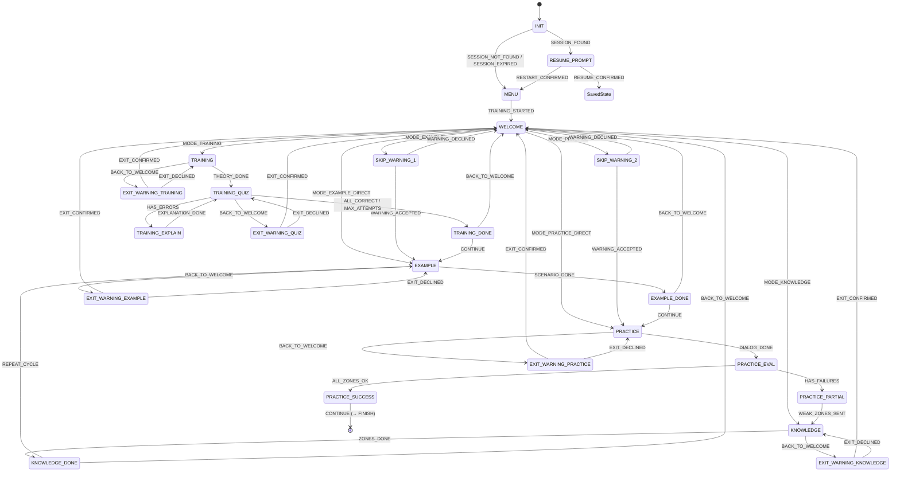

# Дизайн FSM обучающего тренажёра

> Этот документ описывает **полную структуру FSM** после Среза 1 +
> возврата в WELCOME (Коммит 2). На момент Коммита 1 часть состояний
> и переходов ещё не реализована — пометка «(будет в Коммите 2)»
> явно указывает на это.

## Назначение FSM

FSM управляет **порядком прохождения сценария обучения**: от входа
в бот до завершения. Она не знает про:

* конкретные тексты сообщений и промптов;
* содержимое теории, сценариев, диалогов;
* решения LLM (правильный/неправильный ответ) — они приходят как факты
  через команды;
* транспорт (Telegram / Web / CLI).

FSM знает только: «какое сейчас состояние», «что произошло»,
«куда переходить».

## Состояния

### Существующие (Срез 1)

| Состояние | Назначение |
|---|---|
| `INIT` | Точка входа. Решение: продолжить старую сессию или начать новую. |
| `RESUME_PROMPT` | Предложение продолжить найденную сессию. |
| `MENU` | Главное меню. Кнопка «Начать обучение». |
| `WELCOME` | Меню режимов. Точка выбора TRAINING / EXAMPLE / PRACTICE / KNOWLEDGE. |
| `SKIP_WARNING_1` | Предупреждение о пропуске TRAINING при выборе EXAMPLE. |
| `SKIP_WARNING_2` | Предупреждение о пропуске TRAINING при выборе PRACTICE. |
| `TRAINING` | Изложение теории. |
| `TRAINING_QUIZ` | Проверочный квиз после теории. |
| `TRAINING_EXPLAIN` | Разбор неправильного ответа. |
| `TRAINING_DONE` | Теория и квиз пройдены. |
| `EXAMPLE` | Сценарий-пример. |
| `EXAMPLE_DONE` | Сценарий просмотрен. |
| `PRACTICE` | Диалог-практика. |
| `PRACTICE_EVAL` | Получение вердикта LLM по чек-листу. |
| `PRACTICE_PARTIAL` | Часть зон не отработана. Готовится передача в KNOWLEDGE. |
| `PRACTICE_SUCCESS` | Все зоны отработаны. |
| `KNOWLEDGE` | Проработка западающих зон. |
| `KNOWLEDGE_DONE` | Зоны проработаны. Готов цикл. |
| `FINISH` | Конец обучения. |

### Добавляемые в Коммите 2 (возврат в WELCOME)

| Состояние | Назначение |
|---|---|
| `EXIT_WARNING_TRAINING` | Подтверждение выхода из TRAINING. |
| `EXIT_WARNING_QUIZ` | Подтверждение выхода из TRAINING_QUIZ. |
| `EXIT_WARNING_EXAMPLE` | Подтверждение выхода из EXAMPLE. |
| `EXIT_WARNING_PRACTICE` | Подтверждение выхода из PRACTICE. |
| `EXIT_WARNING_KNOWLEDGE` | Подтверждение выхода из KNOWLEDGE. |

## События

### Существующие (Срез 1)

См. `src/domain/events.py` — 27 событий.

### Добавляемые в Коммите 2

| Событие | Назначение |
|---|---|
| `BACK_TO_WELCOME` | Жест «вернуться к выбору режима» из активного или промежуточного состояния. |
| `EXIT_CONFIRMED` | Подтверждение выхода из EXIT_WARNING_* (прогресс блока теряется). |
| `EXIT_DECLINED` | Отказ от выхода, возврат в исходное активное состояние. |

## Полная карта переходов

### Основной поток

```text
INIT
  SESSION_FOUND      → RESUME_PROMPT
  SESSION_NOT_FOUND  → MENU
  SESSION_EXPIRED    → MENU

RESUME_PROMPT
  RESUME_CONFIRMED   → ctx.saved_state (динамический, не в TRANSITIONS)
  RESTART_CONFIRMED  → MENU

MENU
  TRAINING_STARTED   → WELCOME

WELCOME
  MODE_TRAINING        → TRAINING
  MODE_EXAMPLE         → SKIP_WARNING_1
  MODE_EXAMPLE_DIRECT  → EXAMPLE      (если TRAINING пройден)
  MODE_PRACTICE        → SKIP_WARNING_2
  MODE_PRACTICE_DIRECT → PRACTICE     (если TRAINING пройден)
  MODE_KNOWLEDGE       → KNOWLEDGE    (если KNOWLEDGE разблокирован)

SKIP_WARNING_1
  WARNING_ACCEPTED → EXAMPLE
  WARNING_DECLINED → WELCOME

SKIP_WARNING_2
  WARNING_ACCEPTED → PRACTICE
  WARNING_DECLINED → WELCOME

TRAINING
  THEORY_DONE       → TRAINING_QUIZ
  BACK_TO_WELCOME   → EXIT_WARNING_TRAINING       [Коммит 2]

TRAINING_QUIZ
  ALL_CORRECT       → TRAINING_DONE
  HAS_ERRORS        → TRAINING_EXPLAIN
  MAX_ATTEMPTS      → TRAINING_DONE
  BACK_TO_WELCOME   → EXIT_WARNING_QUIZ           [Коммит 2]

TRAINING_EXPLAIN
  EXPLANATION_DONE  → TRAINING_QUIZ

TRAINING_DONE
  CONTINUE          → EXAMPLE
  BACK_TO_WELCOME   → WELCOME                     [Коммит 2]

EXAMPLE
  SCENARIO_DONE     → EXAMPLE_DONE
  BACK_TO_WELCOME   → EXIT_WARNING_EXAMPLE        [Коммит 2]

EXAMPLE_DONE
  CONTINUE          → PRACTICE
  BACK_TO_WELCOME   → WELCOME                     [Коммит 2]

PRACTICE
  DIALOG_DONE       → PRACTICE_EVAL
  BACK_TO_WELCOME   → EXIT_WARNING_PRACTICE       [Коммит 2]

PRACTICE_EVAL
  ALL_ZONES_OK      → PRACTICE_SUCCESS
  HAS_FAILURES      → PRACTICE_PARTIAL

PRACTICE_PARTIAL
  WEAK_ZONES_SENT   → KNOWLEDGE

PRACTICE_SUCCESS
  CONTINUE          → FINISH

KNOWLEDGE
  ZONES_DONE        → KNOWLEDGE_DONE
  BACK_TO_WELCOME   → EXIT_WARNING_KNOWLEDGE      [Коммит 2]

KNOWLEDGE_DONE
  REPEAT_CYCLE      → EXAMPLE
  BACK_TO_WELCOME   → WELCOME                     [Коммит 2]
```

### EXIT_WARNING-состояния (Коммит 2)

```text
EXIT_WARNING_TRAINING
  EXIT_CONFIRMED → WELCOME
  EXIT_DECLINED  → TRAINING

EXIT_WARNING_QUIZ
  EXIT_CONFIRMED → WELCOME      (+ ctx.quiz_question_index = 0,
                                  ctx.last_answer_correct = None)
  EXIT_DECLINED  → TRAINING_QUIZ

EXIT_WARNING_EXAMPLE
  EXIT_CONFIRMED → WELCOME
  EXIT_DECLINED  → EXAMPLE

EXIT_WARNING_PRACTICE
  EXIT_CONFIRMED → WELCOME
  EXIT_DECLINED  → PRACTICE

EXIT_WARNING_KNOWLEDGE
  EXIT_CONFIRMED → WELCOME
  EXIT_DECLINED  → KNOWLEDGE
```

## Mermaid-диаграмма



## Спецслучаи

### `RESUME_CONFIRMED`

Целевое состояние = `ctx.saved_state`. Это **динамический** переход,
он **не** хранится в `TRANSITIONS`. Логика — в
`FSMService._handle_resume_choice`.

### `MODE_KNOWLEDGE` при заблокированном KNOWLEDGE

Если `not ctx.knowledge_unlocked` — состояние **не меняется**, эмитится
эффект `EmitMessage("knowledge_locked_hint")`. Это спецслучай UI:
кнопка нажата, но переход невалиден.

## Связанные документы

* `docs/FSM_INVARIANTS.md` — мутации контекста.
* `docs/adr/ADR-004-llm-verdict-as-fact.md`
* `docs/adr/ADR-005-no-cycle-limits.md`
* `docs/adr/ADR-006-back-to-welcome.md`
